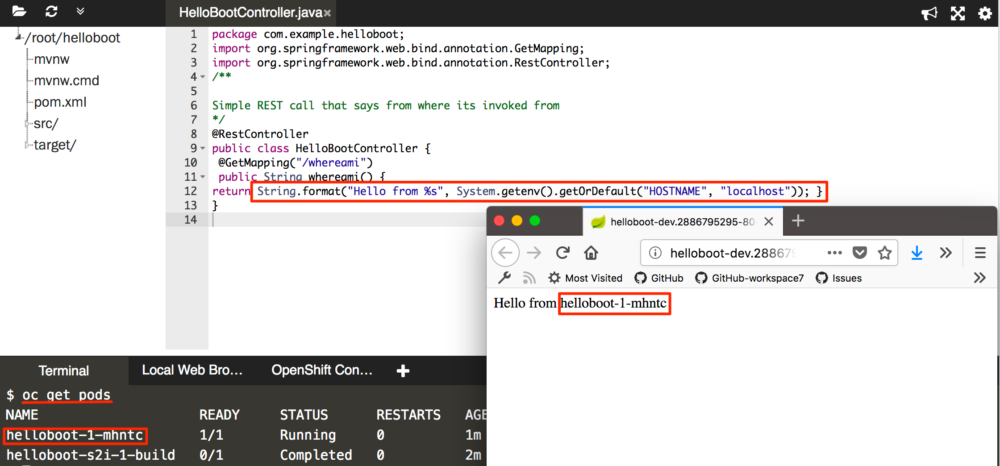

# Deploy to OpenShift Application Platform

**1. Add fabric8 maven plugin**

``./mvnw io.fabric8:fabric8-maven-plugin:3.5.30:setup``{{execute}}

After the command one that differs slightly is the `pom.xml`. Please open the and examine it a bit closer to see fabric8 maven plugin added to it.

``pom.xml``{{open}}

**2. Deploy the application to OpenShift**

Run the following command to deploy the application to OpenShift.  The application will be deployed on to the **dev** project, which we created in the earlier step.

``mvn clean fabric8:deploy -DskipTests``{{execute}}

**3. Test the service from a web browser on OpenShift**

After the maven build as finished, it will typically take less than 20 sec for the application to be available. To verify that everything is started run the following command and wait for it to report replication controller "helloboot-s2i-1" successfully rolled out:

``oc rollout status dc/helloboot``{{execute}}

Then either go to the openshift web console and click on the route or click [here](http://helloboot-dev.[[HOST_SUBDOMAIN]]-80-[[KATACODA_HOST]].environments.katacoda.com/whereami)

**4. Each Spring Boot Application has its own hostname**

When you accessed the application via the [browser](http://helloboot-dev.[[HOST_SUBDOMAIN]]-80-[[KATACODA_HOST]].environments.katacoda.com/whereami) you would have noticed the application returning a response like `Hello from helloboot-1-h20kp`, where the text after __from__ is the **hostname** of where the Spring Boot application is deployed and running.  When deploying Spring Boot application on OpenShift/Kubernetes, each application will have its own hostname as they are deployed as a container within [Kubernetes Pod](https://kubernetes.io/docs/tutorials/kubernetes-basics/explore-intro/).

Run the following command to know the list of running pods:

`` oc get pods``{{execute}}

As you notice from the screen shot about that the pod name from the command ``oc get pods`` {{execute}} and the hostname in the application response via [browser](http://helloboot-dev.[[HOST_SUBDOMAIN]]-80-[[KATACODA_HOST]].environments.katacoda.com/whereami) are the same.
